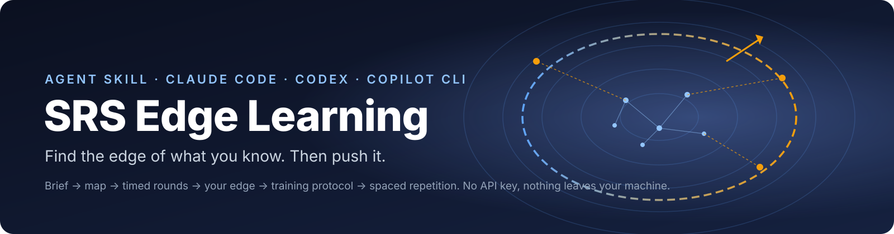
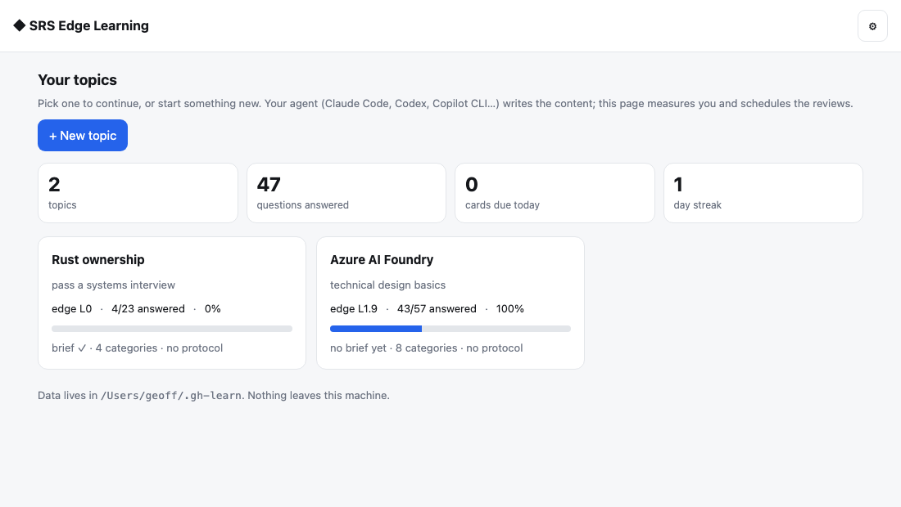
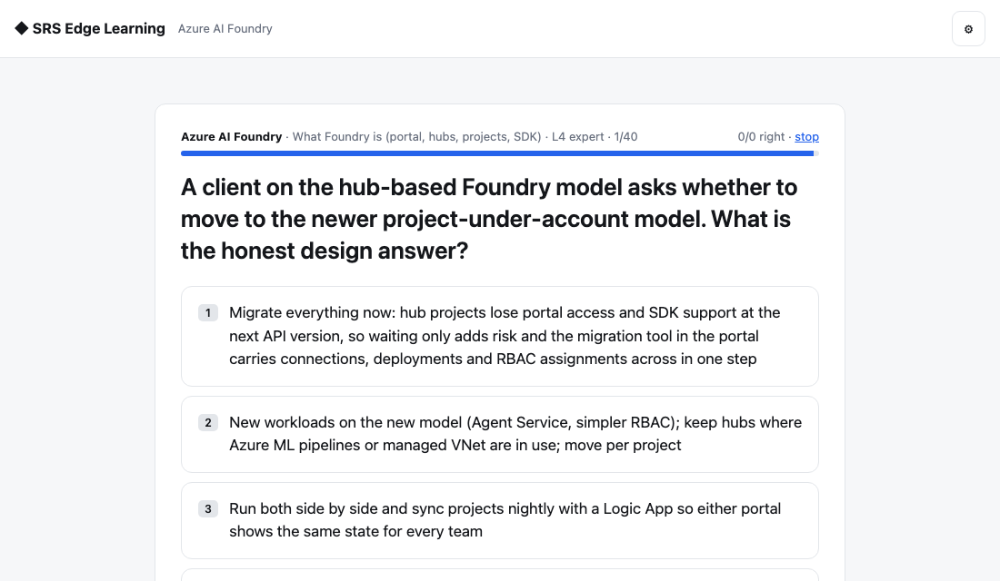
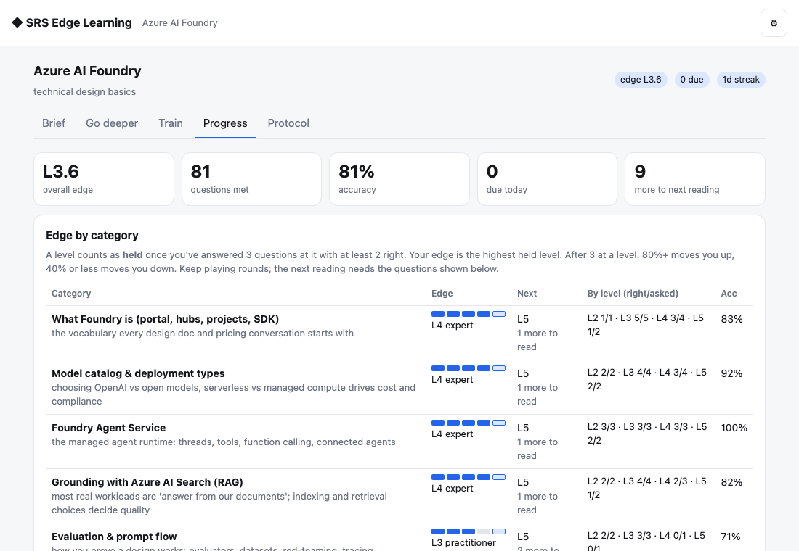
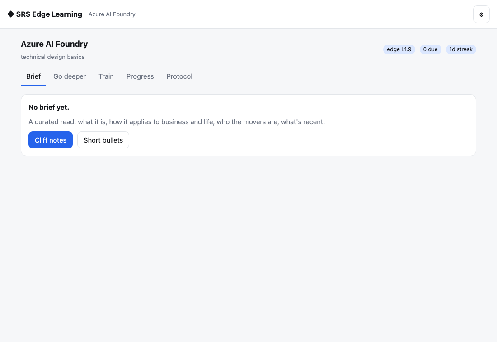
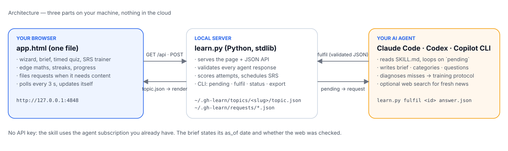
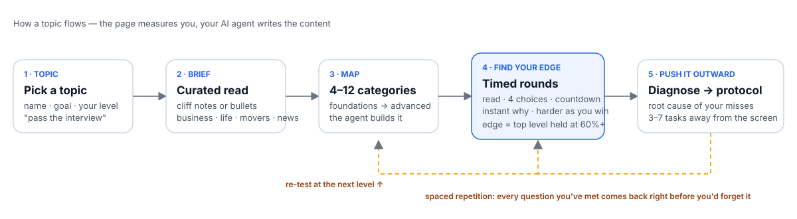

# SRS Edge Learning

   

SRS Edge Learning — get smart at any topic by finding the edge of what you know and pushing it outward. Spins up a local hub (127.0.0.1:4848) that remembers every topic; for a new topic it writes a curated brief (cliff notes or short bullets — what it is, how it applies in business and life, the movers, recent news), then maps the topic into categories, drills you with timed multiple-choice questions that get harder until it finds your edge, diagnoses your misses into a training protocol, and schedules spaced-repetition reviews so you get smarter over time. The agent is the backend (no API key), so it runs in Claude Code, Codex and Copilot CLI alike.

## Install in one line

**macOS / Linux**
```bash
curl -fsSL https://raw.githubusercontent.com/GGCryptoh/srs-edge-learning/main/install.sh | bash
```

**Windows (PowerShell)**
```powershell
irm https://raw.githubusercontent.com/GGCryptoh/srs-edge-learning/main/install.ps1 | iex
```

Then open your agent in a new session and type `/srs-edge-learning <topic>`.

Prefer a zip? [Download srs-edge-learning.zip](https://github.com/GGCryptoh/srs-edge-learning/releases/latest/download/srs-edge-learning.zip) and unzip it into `~/.claude/skills/` (or `~/.codex/skills/`, `~/.copilot/skills/`). [Manual steps](#manual-install) are below.

## What it looks like






## The problem
Most of us "learn" by consuming: read the article, watch the video, ask ChatGPT to explain it, nod, move on. A week later it's gone. Memory research has known for a century why: knowledge sticks when you **produce** it under a bit of pressure (answer, get corrected, try again), not when you passively take it in. And it sticks best when the questions land just past the edge of what you already know — hard enough to make you think, not so hard that you stall.

AI makes the consuming side effortless, which is exactly the trap. This skill flips it: your AI agent becomes the examiner, the roadmap builder, the explainer and the flashcard clerk, and you do the producing.

## What it is
A skill for AI coding agents (Claude Code, Codex, GitHub Copilot CLI) plus a small local web page. You pick a topic. The page and the agent then work through four stages:

1. **Brief.** Cliff notes or short bullets: what the thing is, how it shows up in business and in life, who the movers are, what happened recently, the words to know. Written for *your* goal ("pass an interview", "explain it to a client").
2. **Map.** The agent splits the topic into 4–12 categories, foundations first.
3. **Find your edge.** Timed multiple-choice rounds. You get a few seconds to read the question, then four choices and a countdown. Right or wrong shows instantly with a one-line explanation. Questions get harder as you get them right. Per category, the page works out your *edge*: the hardest level you still hold at 60%+.
4. **Push it outward.** Press *Diagnose my misses* and the agent reads what you got wrong, names the one misunderstanding behind most of it, and writes a training protocol: 3–7 things to do away from the screen, with a date to re-test. Meanwhile every question you've met goes into a spaced-repetition deck, so it comes back right before you'd forget it.

Run the skill again next week and it opens the same page with every topic, your edge per category, a day streak, and what's due for review.

## Why it works
- **Production, not consumption.** Every minute on the page is you answering, not reading.
- **Zone of proximal development.** Questions are pitched at your measured edge plus one level, so they're always just out of reach.
- **Drill first, then learn.** The first round is a diagnosis. You find out what you don't know before you spend a minute studying.
- **Spaced repetition.** Right answers come back in 1 day, 3 days, then stretching gaps. Wrong answers come back tomorrow.
- **A checker, not a cheerleader.** Four fixed choices and one answer. The AI can't agree with you, and the brief says what date its knowledge is from.

## What you need
- A Mac, Windows or Linux machine with Python 3 (Macs have it).
- An AI coding agent that reads skills: Claude Code, Codex CLI, or GitHub Copilot CLI. No API key is needed by the skill itself; it uses the agent you already pay for.
- Five minutes to install.

## Five-minute walkthrough
1. Install (see below). In your agent, type `/gh-learn-something Kubernetes networking` (or whatever you want to get smart at).
2. The hub opens in your browser. Pick **Cliff notes**. Within a minute the brief appears.
3. Click **Go deeper → Build the map**, then **Start a round**. Answer with the number keys. Stop when you like.
4. Open **Progress** to see your edge per category. Press **Diagnose my misses**.
5. Tomorrow, open **Train** and review what's due. Repeat.

## Honest limits
- Multiple choice only. That keeps the timer fair and the edge maths honest, but it won't grade an essay. The training protocol is where the free-form work lives.
- The agent writes questions in batches of 10–12. When the bank runs low mid-round the page asks for more and you wait a minute.
- News and "movers" are only as fresh as your agent's web access. The brief states the date and whether the web was checked.
- Everything stays on your machine in one folder. Nothing is uploaded.

## Where this comes from
I built this because it already worked on me. I've been learning Mandarin with spaced repetition and timed recall, and compressed almost two years of language levelling into 11 months. The pattern is simple: test before you study, keep every question just past your edge, and let scheduling decide what comes back. This skill applies the same pattern to any topic, with an AI agent writing the questions instead of a textbook.

Built by Geoff Hopkins. MIT licensed.





## Manual install

1. Download [srs-edge-learning.zip](https://github.com/GGCryptoh/srs-edge-learning/releases/latest/download/srs-edge-learning.zip) and unzip it. You get a folder `srs-edge-learning/`.
2. Move it to where your agent looks for skills:

   | agent | folder |
   |---|---|
   | Claude Code | `~/.claude/skills/srs-edge-learning/` |
   | Codex CLI | `~/.codex/skills/srs-edge-learning/  (or paste SKILL.md into AGENTS.md)` |
   | GitHub Copilot CLI | `~/.copilot/skills/srs-edge-learning/  (or .github/skills/srs-edge-learning/ in a repo)` |
   | Cursor / Windsurf / other agents | `any folder, then add this line to your rules file: read <path>/SKILL.md and follow it` |

3. New session → `/srs-edge-learning <topic>`. If the agent can't find it: `Read srs-edge-learning/SKILL.md and follow it.`

## Requirements

- `python3` on your PATH (Macs ship python3; Windows: python.org installer with 'Add to PATH')
- An AI coding agent that reads skills: Claude Code, Codex CLI or GitHub Copilot CLI.
- Keys: none. Nothing leaves your machine.

## Repo layout

```
skill/srs-edge-learning/   the skill (SKILL.md is the whole procedure; scripts/ and assets/ are what it runs)
install.sh · install.ps1   one-line installers (download the latest release zip)
docs/           header, diagrams, screenshots
index.html      landing page (GitHub Pages)
```

## Update

Re-run the one-line installer. Your topics and progress live in `~/.gh-learn/` and are untouched.

## License

MIT © 2026 Geoff Hopkins.
